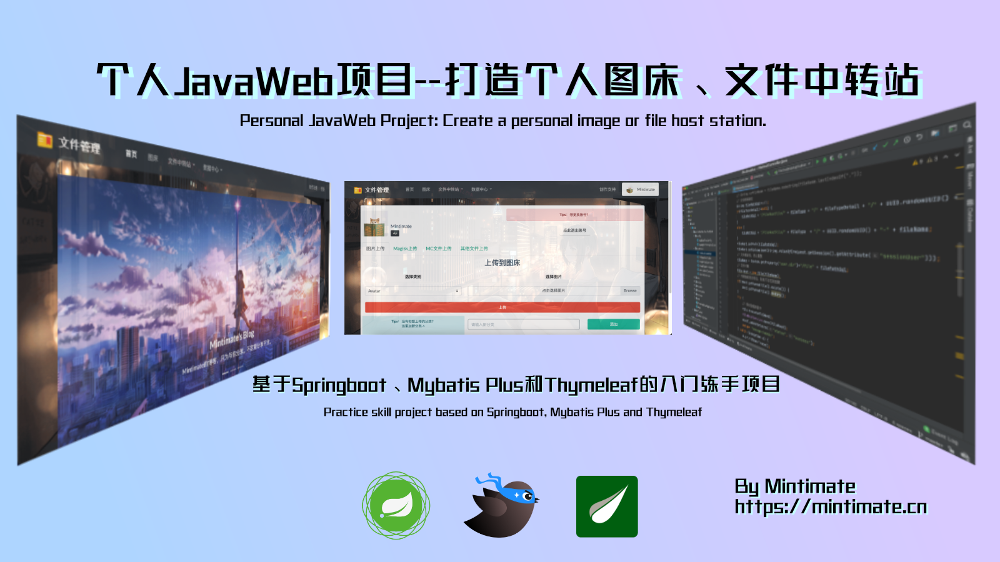

# 项目概述
这个其实就是我上个 [图床项目](https://github.com/Mintimate/ImageHost) 的升级架构版本，也不是什么大工程，就是:`原来有人吐槽和嘲讽原来项目架构不是很好，吐槽JSP效率过低。于是我就升级了一下架构。`区别：
- 原项目基于JSP，本项目基于`Springboot`、`Mybatis Plus`和`Thymeleaf`
- 原项目未使用maven骨架，本项目使用maven骨架
- 本项目进一步规范代码

# 更新日志
- 12.23 修改数据库结构，使用Google开源算法压缩图片生成缩图图并修复下载过程中文件头文件bug
- 12.06 更改图床图片ID默认数据库存取为`雪花ID`，URL获取图片加密为Base64
- 11.15 初始化项目

# 项目说明
## 快速使用
- git clone项目到本地并IDEA导入。
- 导入SQL文件，更改项目内application.yml文件内SQL地址为自己地址
- maven编译并部署到服务器上使用。

项目还在测试，如果需要SQL文件：
- Email：198330181@qq.com
- QQ：198330181

## 完成进度
目前项目粗略完成，暂时能想到还未完成：
- ~~文件分类模块~~
- ~~图片压缩处理~~
- 图片识别
- ~~邮箱验证注册~~

已经完成：
- 图片/文件上传
- 图片直链获取
- 图片/文件删除（逻辑删除）

## 项目结构
采用经典MVC架构
controller层:
- FileHostController:文件处理(上传、下载等)
- FileTypeController:文件分类(查询分类、增加分类等)
- ImageHostController:图床管理(直链获取、上传等)
- ImageTypeController:图片分类
- UserAdminController:用户模块
- UserIpController:IP记录处理

具体请移步到我的个人博客：Mintimate's Blog 博客内也有我联系方式。

# 关于开源
象征性开源，给刚刚开始学Mybatis、Spring的人一些参考。另外，不再加一用Thymeleaf，建议使用Vue做前端。

# 项目后续
项目后续可能不会更新，现在前后端分离为常态，后续也可能把项目前端换为Vue，或者后端重构为PHP。